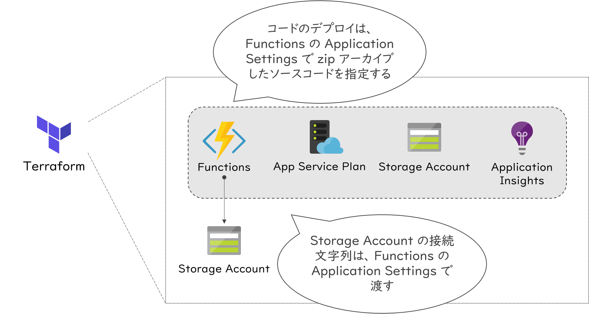

# Terraform on Azure ハンズオン

## コンテンツ

- はじめに
- 環境準備
- セルフペース ハンズオン

## はじめに

これは、 HashiCorp の [Terrform](https://www.terraform.io/) を用いて Azure 上にサーバーレスリソースをデプロイするセルフペース ハンズオンの資料です。

## 環境準備

本ハンズオンに取り組むにあたり、下記の環境をご準備ください。 **\*** は必須です。

| 必要なもの | 説明 |
|----|----|
| Azureアカウント (**\***) | Azureポータル上で作業するので、サインインして利用できるサブスクリプションがあることをご確認ください。Azureアカウントをお持ちでない場合は、こちら [Azure の無料アカウントを今すぐ作成しましょう - Microsoft Azure](https://azure.microsoft.com/ja-jp/free/) から無料枠で利用できるアカウントを作成することができます。 |

Terraform を扱うには、いくつかの方法があります。

- [Azure Cloud shell](https://docs.microsoft.com/ja-jp/azure/cloud-shell/overview) を利用する
- お手元のマシンに [Terraform CLI](https://www.terraform.io/docs/cli-index.html) を準備する
- 無料の SaaS である [Terraform Cloud](https://www.terraform.io/docs/cloud/index.html) を利用する

Azure Cloud shell は、Azure のアカウントさえあれば、ブラウザ上ですぐに利用できます。Azure CLI や Visual Studio Code ベースのエディタをはじめ、 Terraform CLI などサードパーティ製ツールも組み込まれています。また、ファイルをアップロードすることもできます。詳しくは下記をご参考ください。

- 参考：[Terraform 用に Azure Cloud Shell を構成する | Microsoft Docs](https://docs.microsoft.com/ja-jp/azure/terraform/terraform-cloud-shell)
- 参考: [Cloud Shell にローカル ファイルを転送する | Microsoft Docs](https://docs.microsoft.com/ja-jp/azure/cloud-shell/persisting-shell-storage#transfer-local-files-to-cloud-shell)

Terraform Cloud または Terraform CLI を利用するにはそれぞれのドキュメントを参照してください。

なお、Azure Cloud shell では、すでに認証設定が構成された状態で利用できます。Terraform Cloud や Terraform CLI を利用される方は、各ドキュメントに従って Azure プロバイダの認証設定を構成してください。

- 参考: [Authenticating to Azure - Provider: Azure - Terraform by HashiCorp](https://www.terraform.io/docs/providers/azurerm/index.html#authenticating-to-azure)

## セルフペース ハンズオン

### ハンズオン概要

ハンズオンでは、 Terraform を用いて、ストレージアカウント (Blob) と連携する Azure Functions をデプロイします。

デプロイされる構成は、下記の機能を有しています。

- ユーザーから REST でリクエストを受けたら、リクエストごとにストレージアカウント (Blob) にファイルを書き込む
  - 書き込む内容は、HTTP クエリ文字列や POST のリクエストボディにて指定する

#### デプロイするリソース

| リソース | 説明 |
|----|----|
| Azure Functions | ソースコードは、 Node.js で記述する |
| App Service Plan | Azure Functions に付随する。ソースコードを Node.js で記述したいので、より適した Linux 環境を採用する |
| Storage Accounts | Azure Functions に付随する。 |
| Application Insights | Azure Functions に付随する。（必須ではないが、モニタリングのため不可欠） |
| Storage Accounts (ログ出力用) | Functions のサンプルコードから使用するストレージ |

#### 進め方

それでは、こちらの [セルフペース ハンズオン手順](./docs/selfpaced-handson.md) に進み、実際に Terraform を用いてサーバーレス環境を Azure にデプロイしてみましょう。
