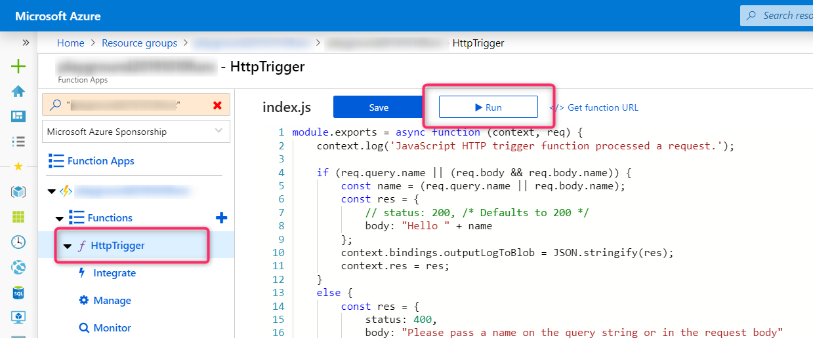
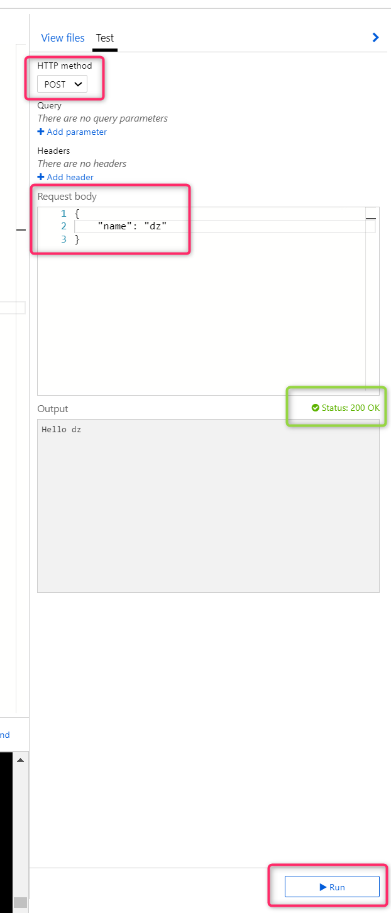
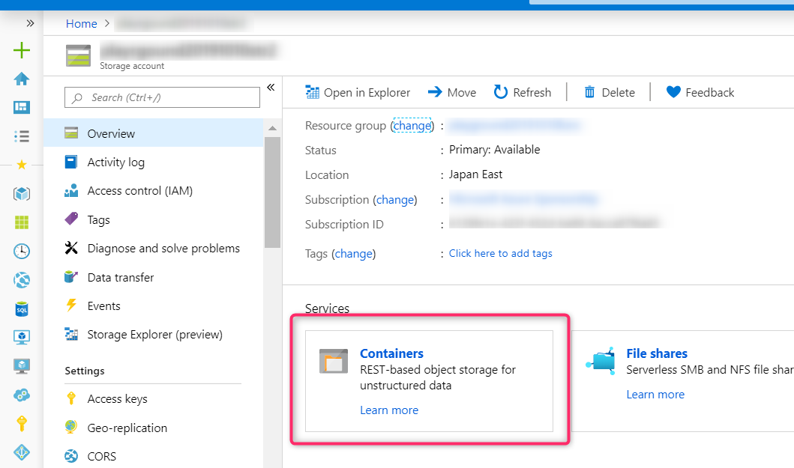
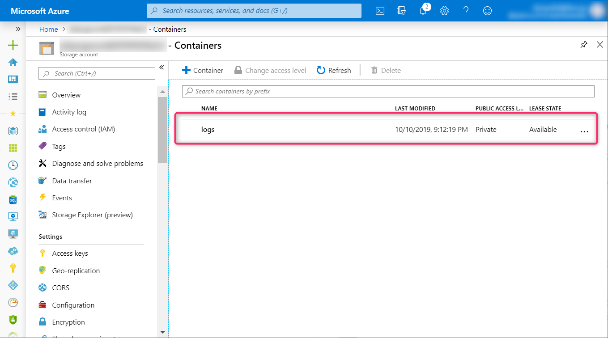
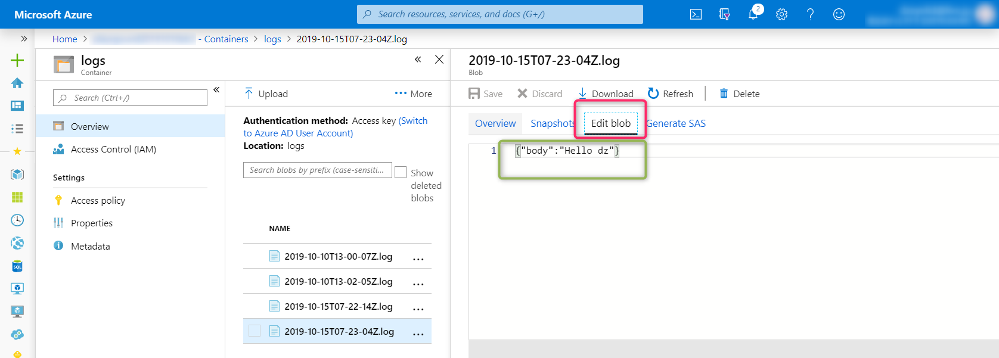

# セルフペースハンズオン

本手順では Azure Cloud shell (bash) を前提に進めます。

大まかな手順は下記のとおりです。

1. Terraform の定義ファイルを編集する
2. Terraform を使ってリソースをデプロイする
3. 動作確認を行う

## 1. Terraform の定義ファイルを編集する

Azure Cloud shell のターミナルで下記の操作を行います。

```bash
# 作業用ディレクトリを作成し、そのディレクトリに移動する
mkdir <作業用ディレクトリ>
cd <作業用ディレクトリ>

# 空のファイルを作成し、エディタで開く
touch main.tf
touch main.tfvars
code .
```

Visual Studio Code ベースのエディタが開くので、まず `main.tf` を開き、下記のように編集します。

```terraform
provider "azurerm" { }

variable "resource_group_name" {
  type    = string
}

variable "resource_group_location" {
  type    = string
  default = "japaneast"
}

variable "prefix" {
  type = string
}

variable "app_service_plan_sku_tier" {
  type = string
  default = "Standard"
}

variable "app_service_plan_sku_size" {
  type = string
  default = "S1"
}

variable "storage_tier" {
  type    = string
  default = "Standard"
}

variable "storage_replication_type" {
  type    = string
  default = "LRS"
}

variable "storage_tier_for_log" {
  type    = string
  default = "Standard"
}

variable "storage_replication_type_for_log" {
  type    = string
  default = "LRS"
}

variable "storage_container_name_for_log" {
  type    = string
  default = "logs"
}

locals {
  app_service_plan_name = join("", [var.prefix, "-plan"])
  application_insights_name = join("", [var.prefix, "-insights"])
  function_app_name = join("", [var.prefix, "-func"])
  storage_account_name = random_string.func_storage_name.result
  storage_account_for_log_name = join("", [substr(random_string.func_storage_name.result, 0, 20), "log"])
}

resource "random_string" "func_storage_name" {
  length  = 24
  upper   = false
  special = false
}

resource "azurerm_resource_group" "main" {
  name     = var.resource_group_name
  location = var.resource_group_location
}

resource "azurerm_storage_account" "func" {
  name                      = local.storage_account_name
  resource_group_name       = "${azurerm_resource_group.main.name}"
  location                  = "${azurerm_resource_group.main.location}"
  account_kind              = "StorageV2"
  account_tier              = var.storage_tier
  account_replication_type  = var.storage_replication_type
}

resource "azurerm_app_service_plan" "func" {
  name                = local.app_service_plan_name
  resource_group_name = "${azurerm_resource_group.main.name}"
  location            = "${azurerm_resource_group.main.location}"
  kind                = "Linux"
  reserved            = true

  sku {
    tier = var.app_service_plan_sku_tier
    size = var.app_service_plan_sku_size
  }
}

resource "azurerm_application_insights" "func" {
  name                = local.application_insights_name
  resource_group_name = "${azurerm_resource_group.main.name}"
  location            = "${azurerm_resource_group.main.location}"
  application_type    = "Node.JS"
}

resource "azurerm_function_app" "func" {
  name                      = local.function_app_name
  resource_group_name       = "${azurerm_resource_group.main.name}"
  location                  = "${azurerm_resource_group.main.location}"
  app_service_plan_id       = "${azurerm_app_service_plan.func.id}"
  storage_connection_string = "${azurerm_storage_account.func.primary_connection_string}"
  version                   = "~2"

  site_config {
      linux_fx_version  = "DOCKER|mcr.microsoft.com/azure-functions/node:2.0-node8-appservice"
  }

  app_settings = {
    FUNCTIONS_WORKER_RUNTIME        = "node"
    APPINSIGHTS_INSTRUMENTATIONKEY  = "${azurerm_application_insights.func.instrumentation_key}"
    WEBSITE_NODE_DEFAULT_VERSION    = "10.14.1"
    WEBSITE_RUN_FROM_PACKAGE        = "https://github.com/dzeyelid/handson-arm-template/blob/master/functions.zip?raw=true"
    StorageAccountConnStrLog        = "${azurerm_storage_account.log.primary_connection_string}"
  }
}

resource "azurerm_storage_account" "log" {
  name                      = local.storage_account_for_log_name
  resource_group_name       = "${azurerm_resource_group.main.name}"
  location                  = "${azurerm_resource_group.main.location}"
  account_kind              = "StorageV2"
  account_tier              = var.storage_tier_for_log
  account_replication_type  = var.storage_replication_type_for_log
}

resource "azurerm_storage_container" "log" {
  name                  = var.storage_container_name_for_log
  storage_account_name  = "${azurerm_storage_account.log.name}"
  container_access_type = "private"
}
```

つぎに、パラメータ入力用のファイル `main.tfvars` を下記のように編集します。

```terraform
resource_group_name               = "handson-terraform-on-azure"
resource_group_location           = "japaneast"
app_service_plan_sku_tier         = "Basic"
app_service_plan_sku_size         = "B1"
storage_tier                      = "Standard"
storage_replication_type          = "LRS"
storage_tier_for_log              = "Standard"
storage_replication_type_for_log  = "LRS"
```

## 2. Terraform を使ってリソースをデプロイする

ターミナルに戻り、下記を実行しデプロイします。このとき、変数 `PREFIX` を適宜設定してください。アルファベットの大文字小文字、数字、ハイフンを利用できます。（先頭の文字はアルファベットと数字のみ）

```bash
# terraform の準備を行う
terraform init

# PREFIX 変数を設定する
PREFIX=

# Plan を確認する
terraform plan -var-file="main.tfvars" -var=prefix="${PREFIX}"

# デプロイする
terraform apply -var-file="main.tfvars" -var=prefix="${PREFIX}"
```

`terraform apply` を実行すると、plan が表示されたあと、下記のようにデプロイを実行してよいか確認されるので、 `yes` と入力して進めてください。

```bash
...

Do you want to perform these actions?
  Terraform will perform the actions described above.
  Only 'yes' will be accepted to approve.

  Enter a value: yes
```

なお、今回はハンズオンなので最低限の作業にとどめています。実際の運用では、公式ドキュメントが示すベストプラクティスなどに従ってください。

- 参考: [Running Terraform in Automation | Terraform - HashiCorp Learn](https://learn.hashicorp.com/terraform/development/running-terraform-in-automation)

## 3. 動作確認を行う

デプロイが完了すると、 Azure Functions に HttpTrigger という関数がすでにデプロイされている状態になっています。動作確認では、これを実行し結果をみます。ポータルから確認を行う場合は、下記をご参考ください。

Azureポータルでデプロイしたリソーグループ「handson-terraform-on-azure」を開き、その Azure Functions の Functions から「HttpTrigger」を開きます。「Run」ボタンを選択します。


画面の右にスクロールした先に、リクエストを送信できる画面が開きます。赤枠のように POST を指定し、body に `{"name": "you"}` などを指定し、「Run」ボタンをクリックして、リクエストを送信します。


すると、ログ用ストレージアカウント（名前の末尾が `logs` ）の logs コンテナにログが出力されます。






この動作が確認できればデプロイ成功です:raised_hands:
